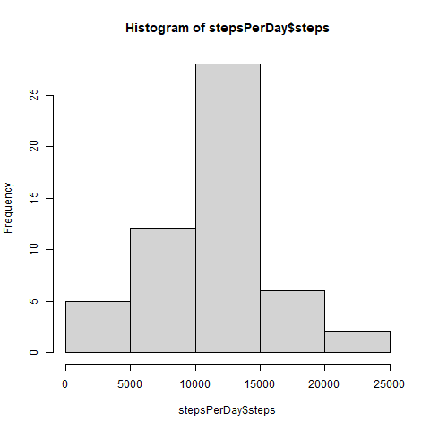
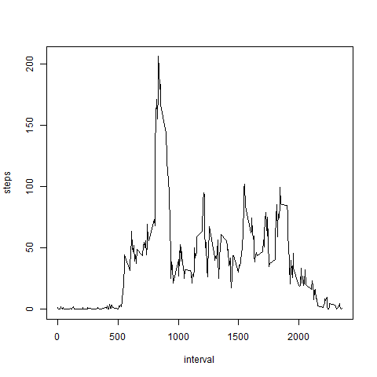
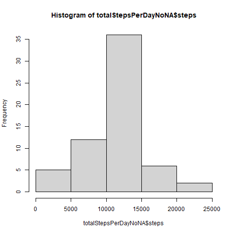
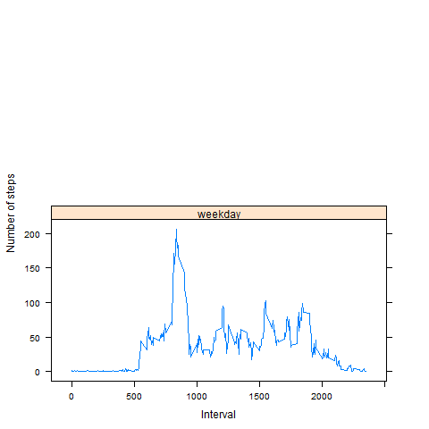

## Loading and preprocessing the data

Unzip data to obtain a csv file.


```r
activityData <- read.csv("./activity.csv")
summary(activityData)
```

```
##      steps                date          interval     
##  Min.   :  0.00   2012-10-01:  288   Min.   :   0.0  
##  1st Qu.:  0.00   2012-10-02:  288   1st Qu.: 588.8  
##  Median :  0.00   2012-10-03:  288   Median :1177.5  
##  Mean   : 37.38   2012-10-04:  288   Mean   :1177.5  
##  3rd Qu.: 12.00   2012-10-05:  288   3rd Qu.:1766.2  
##  Max.   :806.00   2012-10-06:  288   Max.   :2355.0  
##  NA's   :2304     (Other)   :15840

```


```r
head(activityData)
```


```
##   steps       date interval
## 1    NA 2012-10-01        0
## 2    NA 2012-10-01        5
## 3    NA 2012-10-01       10
## 4    NA 2012-10-01       15
## 5    NA 2012-10-01       20
## 6    NA 2012-10-01       25
```

## What is mean total number of steps taken per day?


```r
stepsPerDay <- aggregate(steps ~ date, activityData, sum, na.rm=TRUE)
```

```
##           date steps
##  1: 2012-10-01    NA
##  2: 2012-10-02   126
##  3: 2012-10-03 11352
##  4: 2012-10-04 12116
##  5: 2012-10-05 13294
##  6: 2012-10-06 15420
##  7: 2012-10-07 11015
##  8: 2012-10-08    NA
##  9: 2012-10-09 12811
## 10: 2012-10-10  9900
```

```r
hist(stepsPerDay$steps)
```

<!-- -->


```
##    Mean_Steps Median_Steps
## 1:   10766.19        10765
```

## What is the average daily activity pattern?


```r
stepsPerInterval<-aggregate(steps~interval, data=activityData, mean, na.rm=TRUE)
plot(steps~interval, data=stepsPerInterval, type="l")
```

<!-- -->

```r
intervalWithMaxNbSteps <- stepsPerInterval[which.max(stepsPerInterval$steps),]$interval
intervalWithMaxNbSteps
```

```  
## 1:          835
```

## Imputing missing values


```r
totalValuesMissings <- sum(is.na(activityData$steps))
totalValuesMissings
```

```
## [1] 2304
```

```r
getMeanStepsPerInterval<-function(interval){
    stepsPerInterval[stepsPerInterval$interval==interval,]$steps
}
```

```r
activityDataNoNA<-activityData
for(i in 1:nrow(activityDataNoNA)){
    if(is.na(activityDataNoNA[i,]$steps)){
        activityDataNoNA[i,]$steps <- getMeanStepsPerInterval(activityDataNoNA[i,]$interval)
    }
}
```


```r
totalStepsPerDayNoNA <- aggregate(steps ~ date, data=activityDataNoNA, sum)
hist(totalStepsPerDayNoNA$steps)
```
<!-- -->

```r
meanStepsPerDayNoNA <- mean(totalStepsPerDayNoNA$steps)
medianStepsPerDayNoNA <- median(totalStepsPerDayNoNA$steps)
```

```
##    meanStepsPerDayNoNA  medianStepsPerDayNoNA
## 1:    9354.23                 10395
```

## Are there differences in activity patterns between weekdays and weekends?


```r
activityDataNoNA$date <- as.Date(strptime(activityDataNoNA$date, format="%Y-%m-%d"))
activityDataNoNA$day <- weekdays(activityDataNoNA$date)
for (i in 1:nrow(activityDataNoNA)) {
    if (activityDataNoNA[i,]$day %in% c("Saturday","Sunday")) {
        activityDataNoNA[i,]$day<-"weekend"
    }
    else{
        activityDataNoNA[i,]$day<-"weekday"
    }
}
stepsByDay <- aggregate(activityDataNoNA$steps ~ activityDataNoNA$interval + activityDataNoNA$day, activityDataNoNA, mean)
```


```r
names(stepsByDay) <- c("interval", "day", "steps")
library(lattice)
xyplot(steps ~ interval | day, stepsByDay, type = "l", layout = c(1, 2), 
    xlab = "Interval", ylab = "Number of steps")
```

<!-- -->
